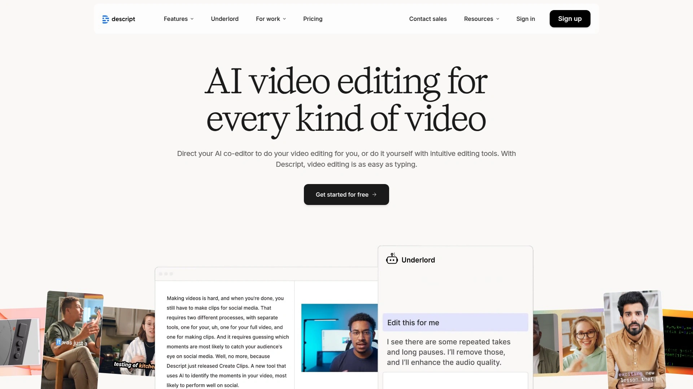
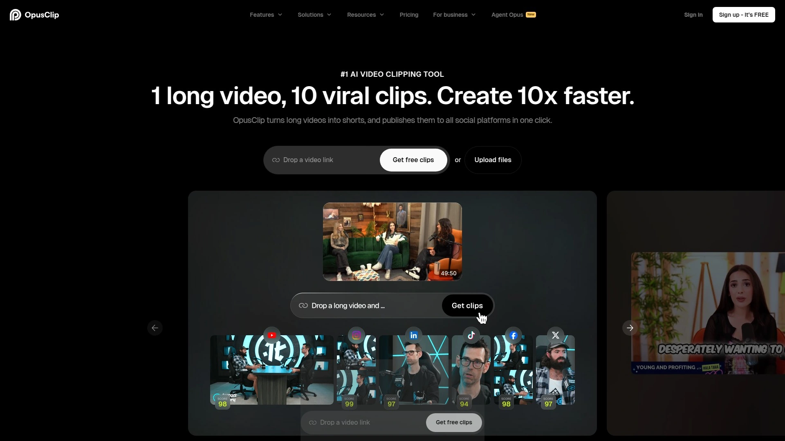

# 2025年排名前18的AI播客内容工具盘点(最新整理)

录完播客音频,接下来要做的事情能让人崩溃——写文字稿、整理节目笔记、剪辑短视频片段、配字幕、发社交媒体、写博客推广文章,这些活儿加起来比录制本身还要耗时间。手工做这些事情,一集播客的后期能拖上好几天。好消息是现在有一堆AI播客内容工具能把这些苦力活自动化,上传音频文件后,AI几分钟就能给你生成转录文本、节目摘要、社交媒体帖子、视频片段,甚至连SEO优化的博客文章都写好了。本文整理了18个当前最值得关注的AI播客工具,从全流程自动化平台到专注某个细分功能的专业工具,覆盖转录、编辑、内容生成、音频增强、视频制作等各个环节,帮你找到适合自己工作流程的那几款。

## **[Castmagic](https://www.castmagic.io)**

一键上传音频,AI自动生成100+种内容资产,播客后期制作的全能选手。

Castmagic能做的事情多到让人惊讶。你上传一段播客音频或视频,它会自动识别说话人、生成逐字转录稿、提取关键引言、创建节目笔记、列出时间戳、写博客文章、制作社交媒体帖子、生成邮件通讯内容,甚至连嘉宾简介和剧集标题都帮你写好。这种全方位的内容生成能力让你从一段音频里榨出最大价值,不用在多个工具间来回折腾。

转录质量在测试中表现最佳,准确度高且说话人识别(diarization)功能特别出色,能清楚区分对话中的不同角色,不像某些工具输出一堆不分段的文字墙。用户界面设计直观,操作体验流畅,新手上手不费劲。

**内容定制化功能**强大——你可以上传自己过往表现好的帖子作为样本,AI会学习你的语气、格式、风格,生成的新内容保持一致调性。编辑器支持可视化修改,点击任何一段文字就能调整,实时看到效果。

音频处理方面,内置一键降噪和语音增强功能,点击按钮就能移除背景杂音、提升清晰度,省去专业音频编辑软件。支持RSS订阅自动导入、YouTube和Vimeo链接导入,也可以直接上传音视频文件,接入方式灵活。

**团队协作**机制完善,可以给团队成员分配权限,大家在同一份转录稿上协作编辑,适合有多人参与的播客项目。导出选项丰富,生成的内容可以一键推送到博客、社交平台,或者导出为Markdown、PDF等格式。

定价从每月39美元起,提供200分钟处理额度,有免费试用期让你测试完整功能。适合个人播客主、内容创作者、播客代理机构,以及任何需要从播客音频中批量生成营销素材的场景。

***

## **[Podsqueeze](https://podsqueeze.com)**

专注生成高质量节目笔记和营销文案,输出内容直接可用。

Podsqueeze在生成节目笔记、时间戳、标题建议、关键引言、博客文章样本这些方面表现特别出色,很多测试者反馈它生成的内容最接近可直接发布的质量。不像某些工具输出的内容还需要大幅修改,Podsqueeze给出的初稿就已经很成熟。

工具自动识别播客中被提到的嘉宾、产品、书籍等信息,整理成结构化列表,方便你在节目笔记里添加链接。生成的时间戳精确到秒,配上描述性标题,听众可以快速跳转到感兴趣的部分。

界面简洁,不会用一堆复杂功能吓跑用户,上传音频后选择要生成的内容类型,几分钟就搞定。支持多种语言转录,不局限于英语播客。

定价亲民,适合预算有限但需要专业输出质量的独立播客主和小团队。

***

## **[Descript](https://www.descript.com)**

文本化音频编辑的先驱,剪辑播客就像编辑Word文档一样简单。

Descript最颠覆的地方是它把音频编辑变成了文字编辑。上传音频后自动生成转录文本,你在文本里删除某句话,对应的音频段落也会自动删除,不需要看波形图、找切入点这些传统操作。对于不懂音频编辑的人来说,这个门槛降低得太明显了。

AI去除填充词功能很好用,自动识别"um""uh""like""you know"这些口头禅并清理掉,让播客听起来更专业。音频增强和降噪工具内置,一键优化音质。

**Magic Clips功能**能自动从长音频中提取精彩片段,生成适合社交媒体的短视频,配上字幕和视觉元素,省去手动剪辑的时间。支持4K视频编辑,如果你做视频播客,这个很有用。

协作功能允许团队成员在同一项目里实时编辑,评论和反馈机制让沟通顺畅。转录支持100多种语言,国际化播客也能处理。

**多轨编辑**支持让你可以分别处理不同说话人的音轨,调整音量、消除某个人的背景噪音,精细化控制。自动生成节目笔记和摘要,格式清晰,可以直接复制粘贴到播客托管平台。

从免费版到专业版都有,免费版提供基础编辑和转录功能,付费版解锁AI工具和高级特性。

***

## **[Podium](https://hello.podium.page)**

AI文案助手,专为播客节目笔记、文章和营销素材设计。

Podium定位很明确——帮你快速生成高质量的播客相关文案。上传音频后,它会生成节目笔记、文章、社交媒体文案、邮件通讯内容,格式化输出让你可以直接使用或稍作调整。

转录准确度高,能正确识别专业术语和人名,减少后期校对工作量。用户界面清爽,功能分类清晰,不会让你在一堆选项里迷路。

支持批量处理,如果你有多集播客需要同时处理,可以一次性上传,节省重复操作时间。生成的内容SEO友好,自动包含关键词和结构化标记,有利于搜索引擎收录。

价格透明,按处理时长计费,适合定期发布播客的内容创作者。

---

## **[Swell AI](https://www.swellai.com)**

为播客制作者和代理机构量身定制的综合内容生成平台。

Swell AI不只做转录,它会分析你的播客风格、内容主题、受众喜好,然后生成符合你品牌调性的各种内容素材。这种一致性对于建立品牌识别度很重要,听众在不同渠道看到的内容都是熟悉的语气。

**互动功能**是它的特色——可以生成听众问答、讨论要点、延伸阅读建议,增强受众参与度。集成Dropbox、Google Drive、RSS订阅,内容从制作到发布形成自动化流水线,不用手动在不同系统间搬运。

适合播客网络、内容代理机构、需要管理多个播客项目的团队,规模化内容生产的理想选择。

***

## **[Riverside.fm](https://riverside.fm)**

录制+编辑+AI处理一体化平台,4K视频质量无惧网络波动。

Riverside.fm是个全流程播客制作平台,从录制到后期都能搞定。录制时支持本地保存,即使网络断了也不影响音视频质量,最高可录4K视频。远程嘉宾也能参与录制,每个人的音视频轨道独立保存,后期编辑灵活。

录完后的AI工具很强大——自动转录支持100多种语言,基于OpenAI技术,准确度高。文本化编辑器让你在转录稿上直接剪辑,选中文字删除,对应音视频自动移除。

**Magic Clips功能**用AI识别音频中的精彩时刻,自动生成短视频片段,配上字幕、背景、动画效果,一键导出到社交平台。还提供免费的播客名称生成器,输入主题就给你一堆命名建议。

适合需要高质量视频播客、远程录制、快速剪辑发布的创作者,从业余到专业级都覆盖。

***

## **[Otter.ai](https://otter.ai)**

实时转录专家,会议、采访、讲座都能记录,团队协作友好。

Otter.ai主打实时转录,你说话的同时它就在生成文字,适合需要边录边看文本的场景。深度集成Zoom、Google Meet、Microsoft Teams,会议时自动加入并记录,结束后转录稿和摘要直接发到你邮箱。

多说话人识别功能能区分团队讨论中的不同成员,给每个人的发言做标记。实时字幕在虚拟会议中很有用,听障人士或者语言不同的参与者都能跟上节奏。

**协作和组织功能**完善——转录稿可以跟Google Calendar条目同步,按日期和主题自动归档;支持云端存储集成,Dropbox、Google Drive都能对接。移动App在iOS和Android上都能用,外出录音也方便。

免费版提供基础转录功能但有限制,付费版解锁自定义词汇、降噪设置、更长的录音时长。主要针对英语,多语言支持还在beta阶段。

适合需要会议记录、播客采访文字稿、讲座笔记的个人和团队。

---

## **[TurboScribe](https://turboscribe.ai)**

速度与准确度兼顾的转录服务,支持98+种语言和超大文件。

TurboScribe基于Whisper AI,转录准确率可达99%,专业术语和技术名词的识别能力强。支持超过80种语言的多语言转录,覆盖面很广。

**ChatGPT驱动的摘要功能**能快速提炼音频要点,审阅长播客时节省大量时间。内置降噪和音频增强,即使原始录音质量一般也能得到清晰的转录结果。

文件大小支持很慷慨,最大可处理5GB或10小时的录音。还能直接输入YouTube链接转录视频,不用下载文件。

批量上传功能让你一次处理最多50个文件,适合积压了大量音频需要集中处理的情况。拖拽上传界面简单直观,技术门槛低。

定价相比Otter.ai更有竞争力,功能覆盖也更全面,对处理大量非英语内容的用户尤其友好。

***

## **[Opus Clip](https://www.opus.pro)**

长视频一键变短片,AI自动找精彩时刻并优化排版。

Opus Clip专门解决一个痛点——把长播客视频变成适合社交媒体的短视频片段。AI会分析整段内容,识别出最有传播潜力的片段,自动剪辑成竖屏或方形视频,配上字幕和视觉效果。

不只是简单切割,Opus Clip会评估每个片段的病毒传播潜力,给出分数,让你优先发布那些最可能火的片段。字幕生成准确且可定制样式,表情符号、高亮关键词这些能提升参与度的元素都支持。

**编辑器**提供精细调整空间——修剪长度、调整构图、添加转场效果、更换背景,把AI生成的初稿打磨成符合你风格的成品。一键发布到TikTok、Instagram、YouTube Shorts等平台,或者下载到本地。

适合想把播客内容扩散到短视频平台、增加曝光度的创作者,特别是那些没时间手动剪辑的忙人。

***

## **[Repurpose.io](https://repurpose.io)**

内容再利用自动化工具,一处发布多平台同步分发。

Repurpose.io的核心价值是把你的播客自动分发到多个平台。在YouTube发布一集视频播客,它可以自动提取音频上传到Spotify、Apple Podcasts,同时把精彩片段发到TikTok、Instagram,全程自动化不需要你重复操作。

支持20多个平台的对接,包括播客托管服务、视频平台、社交媒体,覆盖主流渠道。可以设置自动化规则,比如每次YouTube更新就触发一系列动作,省去手动发布的繁琐。

视频格式转换功能让横屏内容自动裁剪成竖屏或方形,适配不同平台要求。音频提取、字幕添加、片段剪辑这些基础操作都内置,形成完整的内容再利用工作流。

适合在多平台运营的播客主、视频创作者,想最大化内容触达率的场景。

***

## **[Headliner](https://www.headliner.app)**

播客音频转视频的老牌工具,音频图制作简单高效。

Headliner帮你把播客音频转成带可视化波形和字幕的视频,也就是音频图(Audiogram),适合在社交媒体上推广。提供大量预设模板,选一个模板、上传音频、添加封面图片,几分钟就能生成分享级别的视频。

**自动转录和字幕生成**功能让视频更易访问,没声音也能看懂内容。波形动画选项多样,可以根据品牌风格定制。支持多种视频尺寸和分辨率导出,针对Instagram、Facebook、Twitter、LinkedIn等不同平台优化。

可以直接从Headliner发布到社交平台,不用下载再上传。免费版每月提供有限数量的视频制作额度,付费版解锁更多导出次数和高级功能。

适合需要快速制作播客宣传视频、预算有限的个人创作者。

***

## **[Wavve](https://wavve.co)**

音频图生成器,界面友好定制化程度高。

Wavve跟Headliner类似,但在用户体验和定制化上做得更精致。界面设计简洁直观,拖拽式操作让新手也能快速上手。提供几十种模板、字体、动画、配色方案,可以深度定制视觉风格。

**AI亮点识别技术**能自动找出音频中的精彩片段,转化成容易传播的短视频。模板系统支持保存自定义模板,下次制作时直接套用,保持品牌一致性。

可以在应用内直接录制音频,适合做即兴分享或预告片。发布功能集成主流社交平台,制作完马上推送。

定价比Headliner稍高,但功能和体验更精致,适合对视觉呈现有一定要求的创作者。

---

## **[Cleanvoice AI](https://cleanvoice.ai)**

AI音频清理专家,去除填充词、长停顿、口腔杂音,10分钟完成剪辑。

Cleanvoice AI专注音频后期处理,它能自动检测并移除"嗯""啊""like""you know"这些填充词,清理长时间的停顿和沉默,消除呼吸声、口腔杂音。这些手动处理要花几小时的活儿,AI几分钟就搞定。

音质增强功能包括背景降噪、音量标准化、频率平衡,让不同录音环境的音频听起来质量一致。支持多轨音频编辑,可以单独处理每个说话人的轨道。

**多语言转录**和字幕生成功能内置,一站式解决播客后期需求。API支持让开发者可以把Cleanvoice集成到自己的工作流中。

处理速度快,音频保真度高,不会产生机器人感或不自然的停顿。适合重视音频质量、想快速批量处理剪辑的专业播客主和制作公司。

***

## **[Adobe Podcast](https://podcast.adobe.com)**

Adobe免费的AI语音增强工具,一键让录音达到录音棚级别音质。

Adobe Podcast的Enhance Speech功能完全免费,上传音频后AI自动移除背景噪音、回声、房间混响,增强人声清晰度。效果显著,能把在嘈杂咖啡厅或家里录的音频处理得像专业录音棚出品。

**批量上传**支持让你一次处理多个文件,节省重复操作时间。增强强度可调,找到自然度和清晰度的平衡点。支持视频文件处理,包括MP4、MOV格式,可以改善视频播客的音频质量。

实时处理让你马上听到增强效果,不满意可以调整参数重新处理。作为Adobe旗下产品,技术可靠性有保障,不用担心服务突然停止。

局限是它主要做音频清理和增强,不提供转录、剪辑、内容生成这些功能,需要配合其他工具使用。适合预算为零但需要提升音质的播客新手,或者作为专业工作流中的音频预处理步骤。

***

## **[Auphonic](https://auphonic.com)**

自动化音频后期制作服务,专业级音质处理和分发功能。

Auphonic提供自动化的音频后期制作流程,针对播客、广播节目、影片、录屏内容优化。智能音量标准化确保整集节目音量一致,不会出现某段特别大声或特别小声的情况。

多轨混音功能可以平衡主持人和嘉宾的音量,背景音乐自动降低不盖过人声。支持章节标记、显示笔记、封面图片等元数据自动插入音频文件,符合播客标准。

**API接口**让你可以把Auphonic整合到现有脚本、工作流、外部应用中,实现全自动化。对于有大量历史音频需要处理的机构,提供专用设备和托管处理服务。

定价灵活,小规模使用有免费额度,大批量处理可以谈企业方案。适合广播电台、播客网络、内容代理机构等需要标准化音频处理流程的专业组织。

***

## **[Alitu](https://alitu.com)**

播客制作一站式平台,录制、编辑、发布全包,专为非技术用户设计。

Alitu把整个播客制作流程简化到极致,从录音到发布都在一个界面完成。可以本地单人录制,也可以远程连线嘉宾。自动音频清理包括降噪、均衡、标准化,一键应用。

内置播客托管服务,编辑完直接发布到RSS feed,不用另找托管商。提供网站搭建功能,可以创建简单的播客官网展示节目。转录功能生成文字稿,方便写节目笔记或用于SEO。

界面设计遵循"去掉不必要功能"的理念,没有专业音频软件那种吓人的复杂界面。帮助文档详细,随时能找到操作指导,新手友好度很高。

定价按月订阅,包含所有功能没有额外收费项目。适合技术小白、不想学复杂软件、只想快速发布播客的入门级创作者。

***

## **[Resound](https://www.resound.fm)**

AI播客编辑器,由专业音频工程师团队打造,自动化后期制作。

Resound的开发团队制作过多个登顶Apple Podcasts榜首的节目,把专业制作经验转化成AI工具。从2019年就开始训练自己的机器学习模型专门识别"um""ah"填充词,准确度和保真度都很高。

自动化后期制作流程包括去除填充词、清除长时间沉默、音频混音、母带处理,这些专业音频工程师的活儿现在AI能代劳。不同于Alitu的全包方案,Resound专注做好编辑这一件事,不提供录制和托管。

适合已经有录制和托管方案、只需要高质量编辑服务的播客主,或者制作公司想提升后期效率的场景。

***

## **[ElevenLabs](https://elevenlabs.io)**

顶级AI语音合成平台,播客配音和多语言本地化的利器。

ElevenLabs提供极其逼真的AI语音生成服务,可以用来制作播客旁白、广告插播、多语言版本。语音克隆功能让你可以用自己的声音生成内容,不用每次都亲自录。

支持100多种语言和口音,做多语言播客时不需要找各国配音员,AI就能生成自然流畅的本地化版本。语音情感和语调可以调整,适配不同内容氛围。

**播客特定功能**包括长音频生成、批量处理、多说话人对话生成,适合制作完全由AI主持的播客或者辅助人类主持。音质专业,很难听出是AI生成的。

免费版提供有限字符额度试用,付费版按字符数计费。适合需要大量配音素材、多语言扩展、或者探索AI原生播客的创作者。

***

## **[Snipd](https://www.snipd.com)**

AI驱动的播客播放器,边听边记重点,自动生成摘要和笔记。

Snipd不是播客制作工具,而是播客消费端的创新——让听众可以快速捕捉和学习播客内容。通过耳机三连击就能保存当前听到的精彩片段,AI自动生成这段内容的转录和摘要。

**AI章节功能**自动把播客分段并生成概览,听众可以快速导航跳转到感兴趣的部分。跟播客聊天功能让用户可以向AI提问关于这期节目的内容,获得即时回答。

识别节目中提到的书籍、嘉宾,提供相关资源链接,深挖内容价值。支持导出笔记到Notion、Readwise、Obsidian等知识管理工具,打通播客学习和个人知识库。

对于播客制作者来说,了解Snipd可以帮你理解听众如何消费内容,优化节目结构让重点更容易被捕捉和分享。支持25种语言,覆盖国际受众。

***

## 常见问题

**AI播客工具真的能节省时间吗,质量靠谱吗?**

确实能省时间,但得看你用在哪个环节。转录和音频清理这种重复性工作,AI处理速度是人工的十倍以上,一小时音频几分钟就转成文字,而且准确率能达到95-99%,专业术语可能需要人工校对但整体可用。内容生成方面,AI写的节目笔记、社交帖子、博客文章是个不错的初稿,能帮你快速搭起框架,但往往需要加入你的个人观点和调性修改才能达到发布标准。音频编辑工具像Cleanvoice和Resound去除填充词、优化音质的效果很明显,能把业余录音提升到接近专业水平。总体来说,AI处理基础和重复性任务特别高效,创意和个性化部分还是需要人来把关。

**这些工具之间怎么选,需要全部都用吗?**

不需要,而且大部分功能都有重叠。选择策略是先确定你的核心需求和预算。如果想要全流程一站式解决方案,Castmagic或Riverside.fm这种综合平台最省事,一个工具搞定转录、编辑、内容生成、分发。如果你已经有自己习惯的工作流,只想补充某个特定环节,就选专精工具——纯转录用TurboScribe或Otter.ai,音频清理用Cleanvoice或Adobe Podcast,短视频剪辑用Opus Clip,音频图制作用Headliner或Wavve。预算紧张的话,优先选免费或低价的基础工具,像Adobe Podcast完全免费,Podsqueeze和Alitu价格适中功能够用。建议先试用免费版或试用期,实际跑一遍你的播客内容,看哪个输出质量最符合你的标准和风格。

**AI生成的内容会不会让播客失去个性和真实感?**

这取决于你怎么用。如果直接把AI生成的内容原封不动发布,确实会显得公式化和套路。但如果把AI当助手而不是替代品,让它做脏活累活,你专注在创意和个性表达上,效果就完全不同。比如用AI快速生成转录稿和节目笔记框架,你再加入自己的语气、幽默感、独特视角;用AI剪出短视频候选片段,你来决定哪些最能代表节目调性;用AI写博客初稿,你来润色成自己的风格。Castmagic这类工具提供的内容样本学习功能就是为了保持你的个性——AI学会你的语气后生成的内容会更像你自己写的。关键是保持人类主导,AI辅助这个定位,最终呈现给听众的内容必须经过你的审查和加工。

---

## 总结

18个AI播客工具各有专长,从全流程自动化到单点突破,总能找到适合自己工作流的组合。如果你还不知道从哪个开始,建议优先试试[Castmagic](https://www.castmagic.io)——它覆盖转录、内容生成、音频处理、营销素材制作等核心需求,一个工具就能显著减轻你的后期负担,让你把更多精力放在录制高质量内容和与听众互动上。播客创作本该是件享受的事,别让繁琐的后期工作消磨掉你的热情,用对工具能让整个过程轻松很多。

[30](https://skywork.ai/skypage/en/Cleanvoice-AI-In-Depth-Review-(2025):-The-Ultimate-Guide-to-AI-Audio-Polishing/1972567370544902144)
